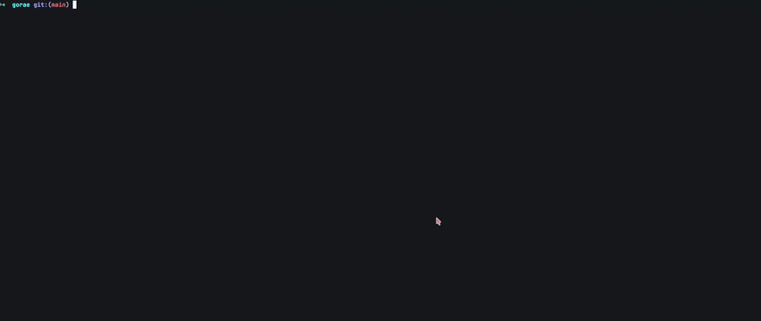

# Gorae

<p align="center">
  
</p>

**Gorae** (*고래*, *whale*) is a terminal-first **TUI knowledge base for PDFs, EPUBs, and Markdown**—fast browsing, solid metadata, instant full-text search, bidirectional links, and a built-in AI assistant—built as a **Vim/CLI-friendly alternative to Zotero, Mendeley, Notion, and Obsidian**.

> The Gorae logo is inspired by the **Bangudae Petroglyphs** (반구대 암각화) in Ulsan, South Korea—one of the earliest known depictions of whales and whale hunting. The “glyph-like” whale shape is meant to feel like an engraving: minimal, timeless, and a little handmade—like a good terminal tool.


<p align="center">
  
</p>

## ✨ Highlights

- ⚡ **Vim-style browsing**: fast file navigation with a cozy TUI feel.
- ⭐ **Favorites**: keep your best papers one keystroke away.
- 📌 **To-read queue**: stash papers for later.
- 🕮 **Reading states**: *Unread / Reading / Read* tracked via metadata.
- 🔎 **Search**: metadata + full-text search with previews/snippets.
- ⚡ **FTS5 instant search**: index your library once with `:index`; content search becomes instant and ranked, no `pdftotext` on every query.
- 🏷️ **Hierarchical tags**: multi-tag support with prefix matching (`ml/` matches `ml/cnn`, `ml/transformers`).
- 🔗 **Bidirectional links**: write `[[document name]]` in any Markdown note to link documents; backlinks appear in the info pane automatically.
- 🖼️ **PDF image preview**: first-page previews inside the preview pane, with terminal-aware rendering paths.
- 🧾 **Auto metadata import**: detect **DOI / arXiv IDs** inside PDFs and fetch info.
- ✍️ **In-app editing**: edit metadata, import from arXiv, copy **BibTeX**.
- 🎨 **Themeable UI**: colors, glyphs, borders — plus helper folders usable in any file manager.
- 🤖 **AI assistant** *(new in v2.0)*: RAG-powered chat over your library via `:gorae` — streaming responses, reasoning trace display, and a live fzf-style file picker. Works with OpenAI, Ollama, and any OpenAI-compatible endpoint.


<!-- TODO: Add a screenshot / GIF / asciinema link -->

## Everyday use

> For deeper instructions, read **[Wiki](https://github.com/Han8931/gorae/wiki)** or run `:help`.

| Action             | Key       |
| ------------------ | --------- |
| Move               | `j/k`     |
| Enter dir / up     | `l` / `h` |
| Select             | `Space`   |
| Favorite / To-read | `f` / `t` |
| Reading state      | `r`       |
| Edit metadata      | `ee`      |
| Search             | `/`       |
| Help               | `:help`   |

> **Arrow keys and mouse** input are also supported.

### Preview support

Gorae includes first-page PDF image previews in the right preview pane.

- **Kitty**: native graphic preview path via `pdftocairo`
- **iTerm2**: terminal image preview support is included
- **Fallback path**: `chafa`-based symbol/image preview when terminal graphics are unavailable or not desired

Tested terminals for the image preview feature:

- **Kitty** on Linux
- **iTerm2** on macOS

### 🔎 Search tips

Press `/` to open search, then type your query.

You can scope the search with flags:

- `-t <title>`     search in title
- `-a <author>`    search in author
- `-y <year>`      filter by year
- `-c <keyword>`   search in full text (content)
- `--tag <tag>`    filter by a single tag
- `--tag <t1,t2>`  filter by multiple tags (comma-separated)

**Examples**
- `/ -t transformer`
- `/ -a "Yoshua Bengio"`
- `/ -y 2023`
- `/ -c attention`
- `/ --tag llm,graph`

### ⚡ Full-text index (FTS)

Content search (`-c`) uses the **FTS5 index** when available — instant, ranked results with no external tools required. Build the index once, then keep it fresh:

```
:index          index all documents under the watch root
:index here     index only the current directory
```

Files are skipped automatically when their size hasn't changed, so re-indexing is fast. The index supports **stemming** (searching "running" also finds "run") via SQLite's built-in porter tokenizer.

> Without an index, content search falls back to scanning files with `pdftotext` as before.

### 🏷️ Tags

Tags are stored as comma-separated values in the metadata editor and normalized into a dedicated table for fast lookup. Browse all tags with:

```
:tags
```

Hierarchical tags (`ml/transformers`, `ml/cnn`) are supported — searching for `ml/` matches all tags under that prefix.

### 🔗 Bidirectional links (Markdown)

In any Markdown file, write `[[filename]]` to link to another document by name. Run `:index` to resolve those links and build the link graph. After indexing:

- **Backlinks** appear at the bottom of the info pane for every document that other files point to.
- Links are resolved case-insensitively by filename (with or without extension).

## Install

For Arch Linux users:
```sh
yay -S gorae
```

### Option A) Run the pre-built executable (no Go required)

Download the ready-to-run binary from the **latest GitHub Release**.

1. **Download the file for your OS/CPU**

   * **Linux:** `gorae`
   * **macOS (Intel):** `gorae-darwin-amd64`
   * **macOS (Apple Silicon / M1–M3):** `gorae-darwin-arm64`
   * **Windows (64-bit):** `gorae-windows-amd64.exe`

2. **(Linux/macOS) Make it executable**

   ```sh
   chmod +x gorae*
   ```

3. **Move it into a folder on your PATH** (so you can run it anywhere)

   * Linux/macOS examples: `~/.local/bin`, `/usr/local/bin`
   * Windows example: `%USERPROFILE%\bin`

4. **Run it**

   ```sh
   gorae
   ```

> Tip: If your downloaded file has a long name (e.g., `gorae-darwin-arm64`), you can rename it to just `gorae` for convenience.

---

### Option B) Quick install (script)

This option builds and installs Gorae using Go.

#### Requirements

* **Go 1.21+**
* **Poppler CLI tools**: `pdftotext`, `pdfinfo`, `pdftocairo`
* **Kitty preview**: native first-page PDF image previews use `pdftocairo` and do not require `chafa`
* **iTerm2 preview**: inline image preview path is supported
* **Optional fallback preview**: `chafa` for non-Kitty / non-inline image text-art previews

Install prerequisites:

* **macOS:** `brew install golang poppler`
* **Debian/Ubuntu:** `sudo apt install golang-go poppler-utils`
* **Arch:** `sudo pacman -S go poppler`

If you want fallback previews outside Kitty:

* **macOS:** `brew install chafa`
* **Debian/Ubuntu:** `sudo apt install chafa`
* **Arch:** `sudo pacman -S chafa`

#### Optional (recommended)

* A fast PDF viewer (**Zathura** recommended)

  * **Debian/Ubuntu:** `sudo apt install zathura zathura-pdf-mupdf`
  * **Arch:** `sudo pacman -S zathura zathura-pdf-mupdf`

1. **Clone the repo**

   ```sh
   git clone https://github.com/Han8931/gorae.git
   cd gorae
   ```

2. **Run the installer**
   (Default install path: `~/.local/bin/gorae` on Linux, `/usr/local/bin/gorae` on macOS)

   ```sh
   ./install.sh

   # Install to a custom path
   GORAE_INSTALL_PATH=/usr/local/bin/gorae ./install.sh
   ./install.sh ~/bin/gorae
   ```

3. **Make sure the install directory is on your PATH**, then run:

   ```sh
   gorae
   ```

> Linux + Kitty: install `poppler`/`poppler-utils` so `pdftocairo` is available, and Gorae will use native image-based first-page PDF previews. `chafa` is not required for the Kitty path.

## Recommended PDF viewer

- Gorae works with any viewer command, but we recommend [Zathura](https://pwmt.org/projects/zathura/) with the MuPDF backend. 
- Zathura is minimal, keyboard-driven, starts instantly, supports vi-style navigation, and renders beautifully through MuPDF—great for tiling window managers.

Install:

* Debian/Ubuntu: `sudo apt install zathura zathura-pdf-mupdf`
* Arch: `sudo pacman -S zathura zathura-pdf-mupdf`

Then set the viewer command in your config:

```json
"pdf_viewer": "zathura"
```

If `zathura` is on your `PATH`, Gorae will auto-detect it, so most users can accept the default.

## AI Chat (`:gorae`)

Gorae has a built-in RAG chat assistant. Open it from anywhere with:

```
:gorae
```

It automatically retrieves relevant chunks from your indexed library and injects them into every query, so answers are grounded in your own documents. Responses stream in real time with a live spinner; press **Esc** at any time to stop generation.

> Run `:index` first so Gorae has content to search. Without an index the assistant still works but has no document context.

### Setup

Type `:config` to open the config file. Gorae will add an `"ai"` block automatically if one doesn't exist yet. The config file supports `//` comments:

```jsonc
"ai": {
  // Provider: "openai" | "ollama" | "custom"
  "provider": "ollama",

  // Model name — e.g. "llama3.2", "gpt-4o-mini", "mistral"
  "model": "llama3.2",

  // API key — leave empty for Ollama
  "api_key": "",

  // Base URL — leave empty to use the provider default
  "base_url": "",

  // Number of document chunks injected as context (default 3)
  "top_k": 3,

  // Optional system prompt prepended before the RAG context
  "system_prompt": ""
}
```

| Field | Description |
|---|---|
| `provider` | `"openai"`, `"ollama"`, or `"custom"` |
| `model` | Model name, e.g. `gpt-4o`, `llama3.2`, `mistral` |
| `api_key` | Required for OpenAI / custom. Leave empty for Ollama. |
| `base_url` | Override endpoint. Defaults: OpenAI → `https://api.openai.com/v1`, Ollama → `http://localhost:11434/v1`. |
| `top_k` | Document chunks injected per query (default `3`). |
| `system_prompt` | Extra instruction prepended before RAG context. |

Changes to `:config` are picked up immediately — no restart needed.

### Connecting to Ollama

Make sure Ollama is running, then set:

```json
"ai": {
  "provider": "ollama",
  "model": "llama3.2"
}
```

No `api_key` or `base_url` needed. Pull the model first if you haven't:

```sh
ollama pull llama3.2
```

Good picks for document Q&A: `llama3.2`, `mistral`, `gemma3`.

### Connecting to OpenAI

```json
"ai": {
  "provider": "openai",
  "model": "gpt-4o-mini",
  "api_key": "sk-..."
}
```

### Custom / OpenAI-compatible endpoint

```json
"ai": {
  "provider": "custom",
  "base_url": "https://api.together.xyz/v1",
  "model": "meta-llama/Llama-3-8b-chat-hf",
  "api_key": "..."
}
```

### In-chat keybindings

| Key | Action |
|---|---|
| `Enter` | Send message / select file |
| `↑` / `↓` | Browse input history · navigate `/find` results |
| `Tab` | Autocomplete `/` command |
| `Ctrl+T` | Toggle reasoning display (expand/collapse `<think>` blocks) |
| `Esc` | Stop streaming · cancel `/find` · exit |
| `Ctrl+P` / `Ctrl+N` | Scroll chat up / down |
| `PgUp` / `PgDn` | Scroll chat half a page |

### In-chat commands

Type `/` to see a live-filtered command list at the bottom of the screen.

| Command | Description |
|---|---|
| `/find <query>` | Live fzf-style file picker — results update as you type |
| `/select` | Clear the currently focused file |
| `/summarize` | Summarize the focused file and save to its note |
| `/sources` | Show documents cited in the last answer |
| `/clear` | Clear conversation history |
| `/export` | Save conversation to a Markdown file in `notes_dir` |
| `/help` | Show help and all keybindings |

### Live file finder (`/find`)

Start typing `/find <query>` and a file picker appears at the bottom of the screen, updating results on every keystroke — no Enter needed to search. Use `↑`/`↓` to move through results, `Enter` to select, `Esc` to cancel.

Once a file is selected it becomes the **focused file**: its full indexed text is injected as primary context for every subsequent question, in addition to the normal RAG results. The status bar shows `focus: filename` while a file is active. Use `/select` to clear it.

### Reasoning / thinking display

Gorae supports models that expose their internal reasoning via `<think>…</think>` blocks (e.g. **DeepSeek-R1**, **Qwen3**, **QwQ**). When such a model is used:

- A collapsed `▶ Thinking… (N lines)` indicator always appears above the response.
- Press **`Ctrl+T`** to expand the full reasoning trace; press again to collapse.
- Thinking content streams live, just like the response.
- The status bar shows `[think:on]` when the expanded view is active.

Standard models (GPT-4o, Llama, Mistral, etc.) that do not emit `<think>` blocks are unaffected.

### Markdown rendering

AI responses are rendered with terminal Markdown: **bold**, `code`, headings, blockquotes, fenced code blocks, and tables all display with theme-appropriate colors. Long lines are word-wrapped to fit the terminal width.

---

## Roadmap

### Fix
* [ ] Delete confirmation prompt
* [ ] Metadata view improvement

### New Features and Todo

* [ ] Open URL
* [ ] ToDo management
* [ ] Vault warden for cloud support
* [ ] WebServer
* [ ] Trash

### Knowledge base (in progress)

* [x] **FTS5 full-text index** — instant ranked content search via `:index`
* [x] **Hierarchical multi-tag table** — normalized tags with prefix matching and `:tags` browser
* [x] **Bidirectional links** — `[[wikilinks]]` in Markdown with backlinks in the info pane
* [ ] **Semantic / vector search** — embeddings via local model (ollama) stored in SQLite
* [x] **AI Q&A over collection** — RAG chat via `:gorae`, works with OpenAI, Ollama, or any OpenAI-compatible endpoint
* [ ] **Citation network** — auto-fetch citation relationships from DOIs via Semantic Scholar

### Gorae AI features

* [ ] Text extraction / OCR
* [ ] TTS
* [ ] AI chat session management
* [ ] Add skills
* [x] `/summarize` command — streams summary and saves to the file's note
* [x] Reasoning/thinking display — collapsible `<think>` blocks with `Ctrl+T`
* [x] Live `/find` file picker — fzf-style, results update as you type
* [ ] Semantic search in Gorae mode
* [ ] Prompt management
* [x] Web search integration — Brave / Tavily with hybrid routing node (rules + LLM classifier)
* [ ] **Daily digest** — `:digest` command summarising recently added documents and newly published arXiv papers matching your library's topics
* [ ] Multifile Handling
* [ ] Session renaming

## Uninstall

1. Delete the binary you installed (default `~/.local/bin/gorae` on Linux or `/usr/local/bin/gorae` on macOS).
2. Remove the config/data folders if you no longer need them:

   ```sh
   rm -rf ~/.config/gorae        # config + theme
   rm -rf ~/.local/share/gorae   # metadata store, notes, db
   ```

That's it—you can re-clone and reinstall at any time.

## Attribution / Credit

This project is licensed under the MIT License.

If you use Gorae in your project, documentation, or distribution, please credit:
- **Gorae by Han**
- link to the project repository

## Acknowledgements

<table>
  <tr>
    <td align="center" width="170">
      <a href="https://github.com/fineday38">
        
      </a>
      <br/>
      <a href="https://github.com/fineday38">fineday38</a>
      <br/>
    </td>
  </tr>
</table>
